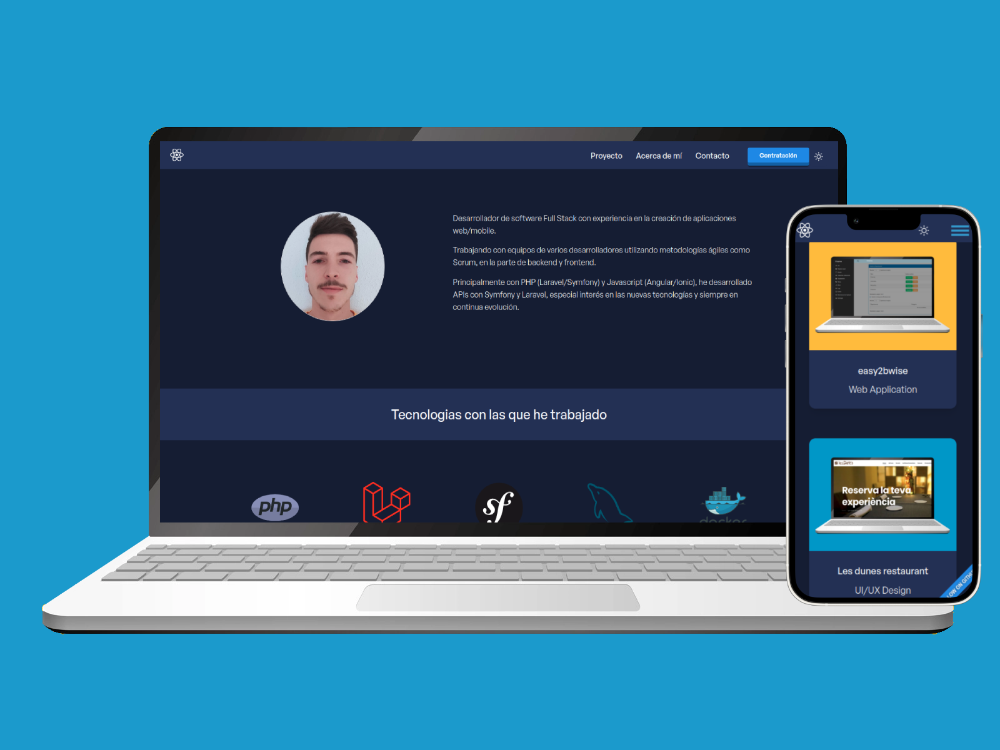

# Portfolio con React & TailwindCSS
<!--- error in file 
/home/fran/Documentos/Code/portfolio/react-tailwindcss-portfolio-main2/node_modules/react-awesome-button/dist/styles.css 
replace calc(var(--button-raise-level) * -1) to  calc(-1 *var(--button-raise-level)
or replace content file to styleAwaseonButton.css bugfixed
--->

¡Hola! Soy Francesc Fores, y este es mi portfolio en línea. Aquí puedes encontrar una selección de mis proyectos de programación, habilidades y experiencia laboral.
## Demo URL
[https://francescfores.github.io/](https://francescfores.github.io/)

¡Gracias por visitar mi portfolio!

## Características

- [React v18](https://reactjs.org) con [React Router v6](https://reactrouter.com)
- [Tailwind CSS v3] (https://tailwindcss.com)
- API de contexto para la gestión del estado
- Ganchos personalizados
- Transiciones y animaciones de Framer Motion
- Componentes reutilizables
- Modo oscuro
- Filtro de proyectos por categoría
- Desplazamiento suave
- Formas dinámicas
- Botón paa volver a la parte superior
- Botón Descargar archivo
- Diseño simple y receptivo

## Commandos

##### Abrir la carpeta del proyecto:
    $ cd react-tailwindcss-portfolio

##### Instalar paquetes y dependencias:
    $ yarn

##### Inicie un servidor de desarrollo local en `http://localhost:3000`:
    $ yarn start

##### Compilar tailwin
    $ npm run build:css o postcss src/css/tailwind.css -o src/css/main.css

## Publicar en gh-pages
    $ npm run build o $ yarn run react-scripts build
    $ npm run deploy o $ gh-pages -d build
